# SURF-ON
(Developer: Roman Rakic)

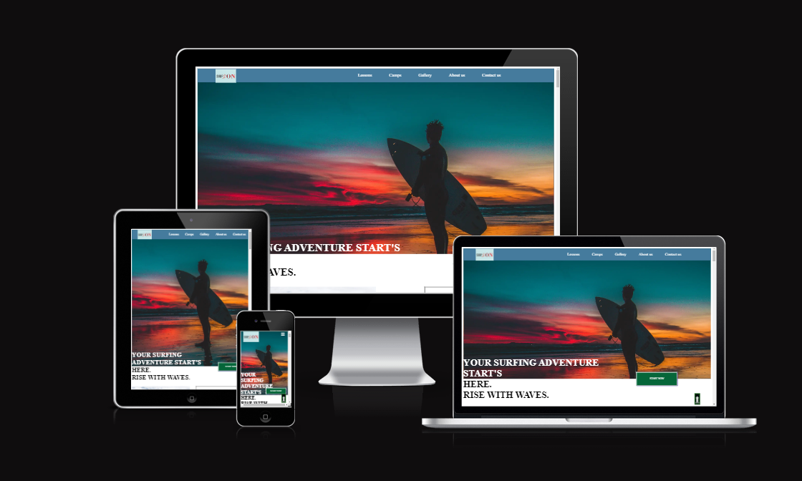

[Live webpage](https://rockroman.github.io/CI_PP1_SO/)

## Table of Content
#
0. [introduction](introduction)
1. [Project Goals](#project-goals)
    - [User Goals](#user-goals)
    - [Company Goals](#company-goals)
2. [User Experience(UX)](#user-experienceux)
    - [Ideal User](#ideal-user)
    - [User Requirements and Expectations](#user-requirements-and-expectations)
    - [User Stories](#user-stories)
3. [Design](#design)
    - [ Chosen Design](#chosen-design)
    - [Wireframes](#wireframes)
    - [Colour](#colours)
    - [Fonts](#fonts)
    - [Structure](#structure)
    
4. [Technologies Used](#technologies-used)
    - [Main Languages Used](#languages)
    - [Frameworks-Libraries & Programs Used](#Frameworks-Libraries-&-Programs-Used)
5. [Features](#features)
     - [Exsisting-features](#existing-features)
     - [Features to implement in future](#features-to-implement-in-future)

6. [Testing](#validation)
    - [HTML Validation](#HTML-validation)
    - [CSS Validation](#CSS-validation)
    - [Accessibility](#accessibility)
    - [Performance](#performance)
    - [Device testing](#performing-tests-on-various-devices)
    - [Browser compatibility](#browser-compatability)
    - [Testing user stories](#testing-user-stories)
8. [Bugs](#Bugs)
9. [Deployment](#deployment)
   - [Deploying on GitHub pages](#GitHub)
10. [Credits](#credits)
11. [Acknowledgements](#acknowledgements)

## Introduction

SURF-ON is website intended for passionate surfing enthuisiast ,and those who are about to become one.
It is an imaginary company but with intention for someone to use the content of SURF-ON site maybe as 
an idea to make imaginary come to life and make surfing community expand.
With that tought im inviting you to join me on a virtual journey of making SURF-ON.
Targeted user is any adventureos person aged 7-120yrs who is willling to learn and enjoy life ,sea,sun ,wind and sand.
Trought this website project user will be briefly introduced with company goals value it brings into the market and services it provides 
Website is first of five milestone projects for acquiring the "Diploma In Software Development" with Code institute.
Requirements of this project
is use of HTML and CSS in creating fully responsive website with minimum 3 pages (or distinct sections)

## Project Goals 
***

### User Goals
- To find a company to learn how to Surf quick,efficient and safe
- See clearly full range of what company offers
- Clear pricing of offers
- Easy to find information about company
- Clearly displayed location of company
- Clearly displayed information how to get in touch with the Buissness 
- Have a few options how to get in touch and connect.

### Company Goals
- Promote and advertise buissnes
- Atrract more and increase the number of new clients
- Expand the buissnes
- Provide expected service to all types of clients
- Provide quick and easy to find information about buissnes to potential clients
- Ensure to have a clear distinction from competitors
- Bring value to client and market

## User Experience(UX)

### Ideal User

Preffered type of user who would benefit from visiting this website and vice versa is
- New user with interest in water sport activity
- Hard-core or experienced surfer
- Returning user happy with value and service buissnes provided 

### User Requirements and Expectations

- Simple and well structured content
- Intuitive and Simple navigation System
- Functionality of Website(everything working as expected)
- Visually appealing design with good presentation
- Accessibility regardless of device and screen size
- Easy and simple way to contact the company 

### User Stories

####  New(First-time) User
0. As a New User,i want to easily to navigate the entire website intuitively.
1. As a New User,i want to know what the company offers.
2. As a New User,i want to know the price of the services that company offers.
3. As a New User,i want to know the best and quickest way to contact the company.
4. As a New User,i want to know where the company is located.
5. As a New User,i want to know how long does the company exists.
6. As a New User,i want to know what does it look like to use one or more of the services.

#### Returning User
7. As a returning user,i need the information im looking for to be easy to find as i remeber.
8. As a returning user,i want to always be no more than 3 clicks away from contacting the company or returning to a starting position.
9. As a returning user,i want to find and connect with company on social media.
10. As a returning user, i want to know more about the team that will possibly train me.
11. As a returning user,i want to see all options that are avaliable to me.
12. As a returning user,i want to be pleased with website  functionality so i can recommend it to my friends

## Design

### Chosen design

This project was design to attract variety of clients and potential users ,using a plain white background for the
body with some vivid sharp images of sea and seaside scenery visualy appealing and eye catching.

### Wireframes

### Colour
- simple colour pallete making website look bright and clean.

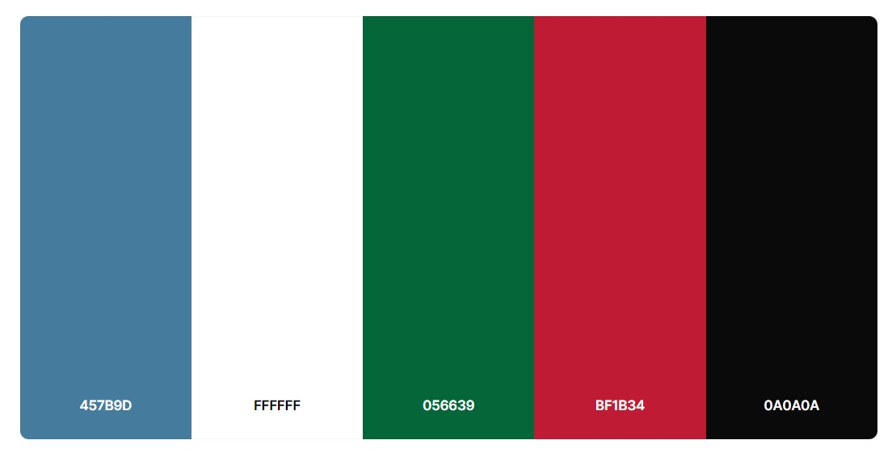

### Fonts

Google fonts used as follows:

- Libre Caslon Text font used for most of website.
applied via @import method to CSS file,i picked this font cause it was specifically tailored to be used for web body text and it can be used at very small sizes and will still be readable 

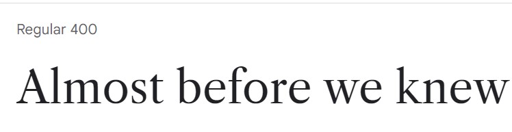

-  System-ui font used for contact form.Imported also via @import method to CSS file and picked this generic font family cause its high readability.

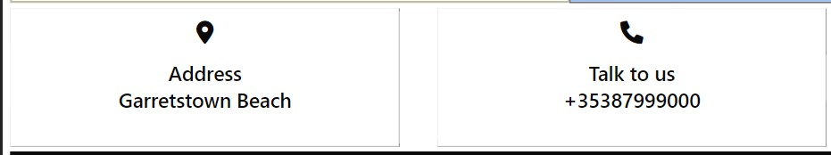

### Structure

  Website is structured in intuitive ,user friendly and familiar way as a one landing page divided into distinct sections.
  Navigation is done separatly for mobile and desktop screens in a standard industry way
  Website is divided into six separate sections as follows:
 1. Main section( hero section with image,2 types of  navigation wich is screen size dependant,welcoming paragraph and brief info about company)
 2. Lessons section(with three types of services for client to choose from)
 3. Camps section(carousel feature with 3 different camps that company offers )
 4. Gallery section(Images capturing the moments from lessons and surfing )
 5. About us section(More information about company)
 6. Contact us section(Information how to get in touch with company ,contact form and google map of the location.)

## Technologies Used

### Languages
- HTML5
- CSS

### Frameworks,Libraries & Programs Used
- Gitpod
- GitHub
- Git
- Tinypng
- Font Awsome
- Balsamiq
- Coolors
- Google Fonts
- looka.com
- Jpg. to Webp converter

## Features

### Existing Features

### Favicon
- small icon or collection of icons associated with a website, web page, or web application in this case i took a custom made company logo

 

### Logo
- Featured in both types of navigation and in footer of a website,custom made on [looka.com](https://looka.com/)
- User story covered: 0

### Navigation
- 2 different types (mobile and desktop)
- both navigations are  intuitive ,easy to use and responsive for all screen sizes
  hamburger menu for mobile and screens up to 768px and sticky nav-bar for screens 768px and up.
  including links to a section of a page gives user a well understood means to easily navigate the website
- desktop style links are underlined and scaling in size when user hoovers over them.
- User story covered:0,7,8

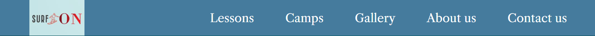
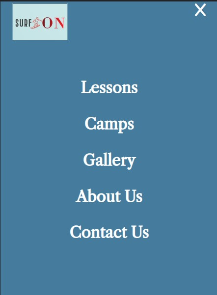

### Welcome and Our services section
- Those 2 sections consist of 3 images supported by
the paragraphs introducing user with company and services that are provided
- User story covered:1,2,12,11

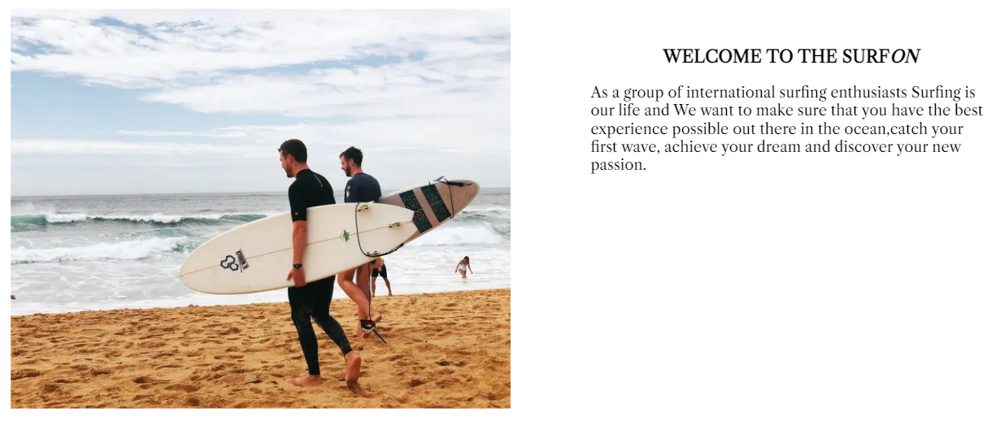
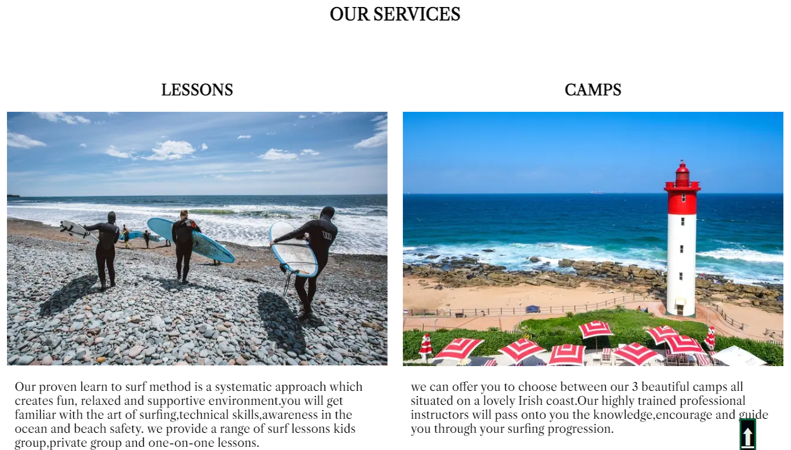

### Lessons cards
- 3 cards with prices for lessons offered by company
and call to action that takes user to contact form section
- User story covered:11,0,2,12

### Carousel
- User is further introduced in options that are  available with images of 3 locations that lessons can take place in.
- options to navigate the carousel images are 
via buttons in bottom part or via swipe on devices that have touch screens.
- User story covered:2,11

### Gallery
- Section consist of 7 images presenting moments taken during
lessons and free Surfing.
- Images are aligned using Css-Flexbox.
- User story covered:6,1

### About us 
- More information about company followed by 
4 cards with images of team members  and brief info 
about their role and experience.
- User story covered:5,12,10

### Contact us
-User can contact the company in various ways when redirected to this section ,which consist of a contact form with embeded 
Google map of a company location and 3 info boxes . address-box 
phone number-box and Email-box.
- all elements are displayed using Css-grid.
- User story covered:0,4,12,3

### Footer
- Consist of 3 parts: Logo of the company(linked to the top of the page).
social media part(links to connect with company)
trade mark part(name of developer and year project was developed)
- User story covered:9,12,0

### Back to top button
- Featured on all screen sizes to assist user in having full control browsing the website content.
- User story covered:8,0,12

## Features to implement in future

### Membership section
- to become a member will bring benefits and discounts to 
user who chooses this option.

### Blog section
- Staff members,users or surfing enthusiasts will have a chance to share interesting stories.

### Online Shop
- Turning a website into a fully functional Surf-shop with various items would mean taking a project to another level.

## Testing

### HTML Validation
 
Testing was taken during entire development process utilizing Chrome developer tools and at the end when project was finished.
W3C Markup Service was used to validate the HTML of the website and all code passed with no errors to show. 

Index.html

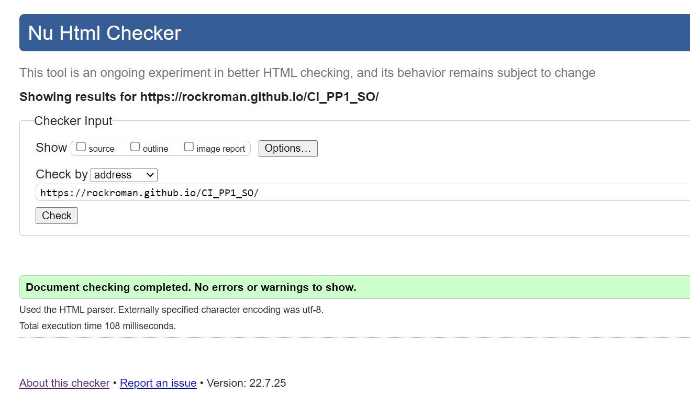

404 page

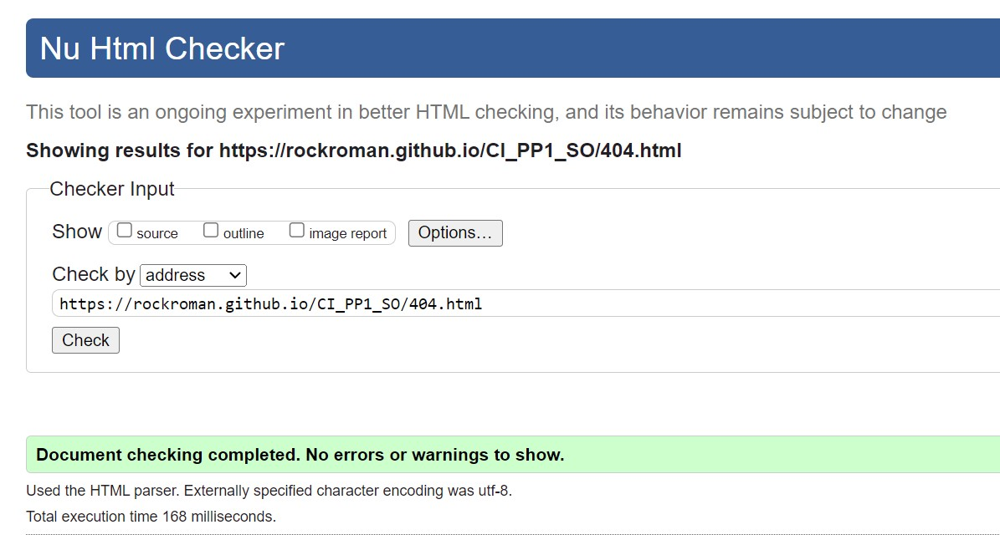

### CSS Validation

The  W3C Jigsaw CSS Validation Service was used to test css code of website.this validator showed no errors.

Css

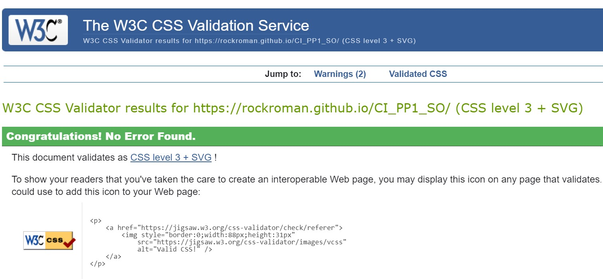

### Accessibility

I used  WAVE WebAIM web accessibility evaluation service to ensure the project's high standards regarding accessibility.

Website

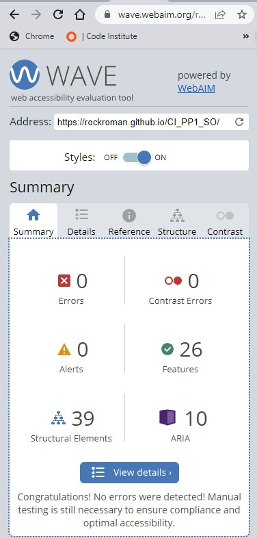

404-page

